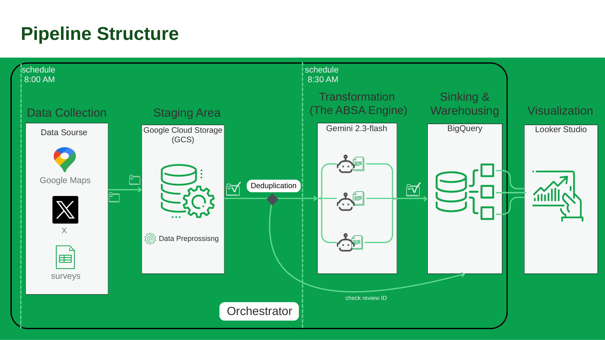
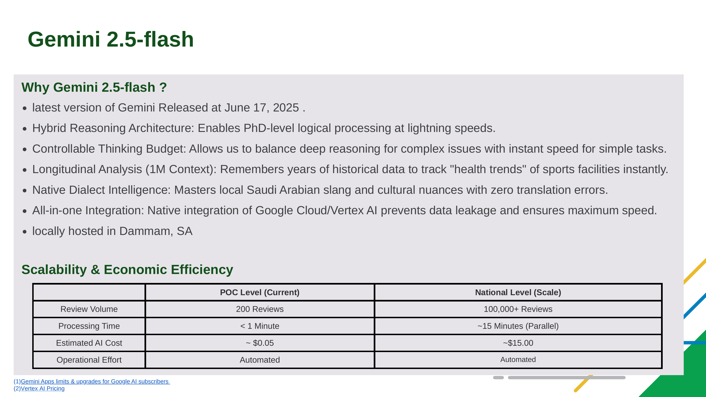
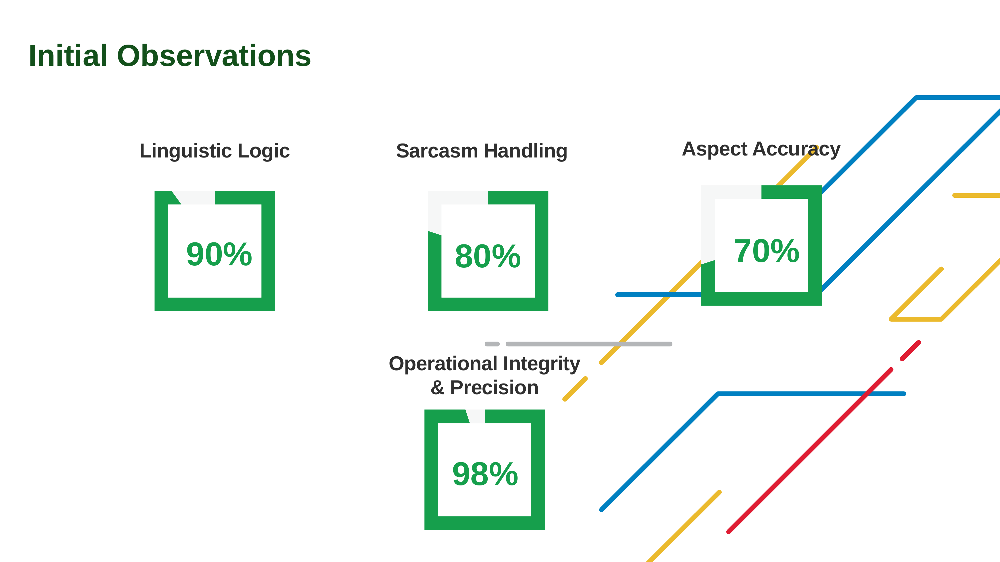
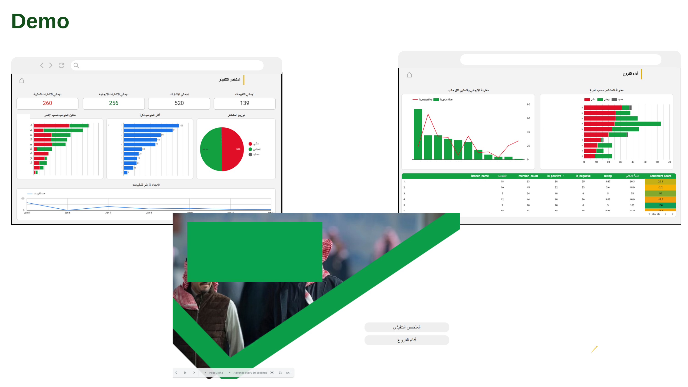

# ABSA Orchestrator

Pipeline orchestrator that reads reviews from Cloud Storage, processes them through the ABSA enricher, and loads results to BigQuery.

## Purpose

Central coordinator for the ABSA pipeline. Handles data ingestion, deduplication, normalization, enrichment, and BigQuery loading.

## Pipeline Architecture



The pipeline runs on two daily schedules and is coordinated end to end by the orchestrator:

1. **Data Collection (8:00 AM)** – Reviews are collected from Google Maps, X (Twitter), and manual surveys.
2. **Staging Area** – Raw files land in Google Cloud Storage (GCS), where light preprocessing is applied.
3. **Deduplication** – Each review gets a unique ID, which is checked against BigQuery so only new reviews move forward.
4. **Transformation – The ABSA Engine (8:30 AM)** – New reviews are sent in parallel to Gemini 2.5 Flash, which extracts each aspect mentioned and its sentiment.
5. **Sinking & Warehousing** – Enriched results are loaded into partitioned BigQuery tables, and analytical views are refreshed.
6. **Visualization** – Looker Studio dashboards read directly from the BigQuery views.

## Features

- Multi-source support (Google Maps, Twitter, Manual CSV)
- Automatic deduplication using review IDs
- Parallel processing with configurable workers
- BigQuery partitioned tables
- Automated analytical views creation
- Arabic text normalization

## Workflow

1. Reads latest CSV from Cloud Storage
2. Creates unique review IDs (MD5 hash)
3. Filters out already processed reviews
4. Normalizes Arabic text
5. Calls Gemini enricher in parallel
6. Loads results to BigQuery
7. Updates analytical views

## Why Gemini 2.5 Flash?



Gemini 2.5 Flash (released June 17, 2025) was chosen as the ABSA engine for these reasons:

- **Hybrid reasoning** – Strong logical reasoning while keeping latency low.
- **Controllable thinking budget** – Deeper reasoning can be enabled for complex or ambiguous reviews, and kept minimal for simple ones to save time and cost.
- **1M-token context window** – Large enough to analyze long stretches of historical reviews and track facility "health trends" over time.
- **Arabic dialect handling** – Handles Saudi dialect, slang, and cultural nuance directly, without a separate translation step.
- **Native Google Cloud / Vertex AI integration** – Data stays inside the same GCP project as GCS and BigQuery.
- **Local hosting** – Available in the `me-central2` region (Dammam, Saudi Arabia), the same region the functions are deployed to.

### Scalability & Cost

| | POC Level (Current) | National Level (Scale) |
|---|---|---|
| Review Volume | 200 Reviews | 100,000+ Reviews |
| Processing Time | < 1 Minute | ~15 Minutes (Parallel) |
| Estimated AI Cost | ~ $0.05 | ~ $15.00 |
| Operational Effort | Automated | Automated |

Cost estimates are based on [Vertex AI Pricing](https://cloud.google.com/vertex-ai/generative-ai/pricing).

## Results – Initial Observations



Initial evaluation of the POC output:

| Metric | Score |
|---|---|
| Linguistic Logic | 90% |
| Sarcasm Handling | 80% |
| Aspect Accuracy | 70% |
| Operational Integrity & Precision | 98% |

The pipeline itself runs very reliably, and the model reads Arabic text and sarcasm well. Aspect extraction (70%) is the main area for improvement in future iterations.

## Dashboard Demo



The Looker Studio report has two pages:

- **Executive Summary (الملخص التنفيذي)** – Totals for reviews, aspect mentions, and positive/negative mentions; sentiment distribution; most-mentioned aspects; sentiment per aspect; and review volume over time.
- **Branch Performance (أداء الفروع)** – Sentiment comparison across branches, positive vs. negative mentions per aspect, and a branch table with rating, positive ratio, and an overall sentiment score.

## Environment Variables

- `PROJECT_ID` - GCP Project ID
- `BUCKET_NAME` - Cloud Storage bucket
- `BQ_DATASET` - BigQuery dataset name
- `BQ_TABLE_RAW` - Table name for raw reviews
- `HANDLER_URL` - URL of gemini enricher function
- `MAX_WORKERS` - Number of parallel workers (default: 2)

## API Usage

### Process All Sources

```bash
curl https://REGION-PROJECT.cloudfunctions.net/absa-orchestrator
```

### Process Specific Source

```bash
# Google Maps only
curl "https://REGION-PROJECT.cloudfunctions.net/absa-orchestrator?source=gmaps"

# Twitter only
curl "https://REGION-PROJECT.cloudfunctions.net/absa-orchestrator?source=twitter"

# Manual CSV only
curl "https://REGION-PROJECT.cloudfunctions.net/absa-orchestrator?source=manual"
```

### Response

```json
{
  "status": "success",
  "timestamp": "2025-02-10T13:45:00",
  "details": {
    "gmaps": {"status": "success", "records": 85},
    "twitter": {"status": "no_new_data"},
    "manual": {"status": "success", "records": 12}
  }
}
```

## Deployment

```bash
gcloud functions deploy absa-orchestrator \
  --runtime python312 \
  --trigger-http \
  --allow-unauthenticated \
  --region me-central2 \
  --set-env-vars PROJECT_ID="${PROJECT_ID}",BUCKET_NAME="${BUCKET_NAME}",BQ_DATASET="${BQ_DATASET}",BQ_TABLE_RAW="${BQ_TABLE_RAW}",HANDLER_URL="${HANDLER_URL}",MAX_WORKERS="${MAX_WORKERS}" \
  --timeout 540s \
  --memory 2GB
```

## BigQuery Views

Auto-created views:
- `reviews_parsed` - Flattened aspect data
- `aspect_summary` - Aspect distribution
- `sentiment_by_source` - Sentiment stats
- `daily_processing_stats` - Daily metrics
- `top_aspects_by_place` - Top aspects per location
- `negative_feedback` - Negative reviews
- `rating_vs_sentiment` - Rating correlation

## Cloud Storage Structure

```
gs://BUCKET_NAME/
├── gmaps/
│   └── fitness_time_all_branches_YYYYMMDD_HHMMSS.csv
├── twitter/
│   └── tweets_YYYYMMDD_HHMMSS.csv
└── manual/
    └── manual_reviews_YYYYMMDD_HHMMSS.csv
```

## Files

- `main.py` - Main orchestrator function
- `bigquery_manager.py` - BigQuery utilities
- `requirements.txt` - Dependencies
- `docs/images/` - Architecture, model choice, results, and dashboard images
